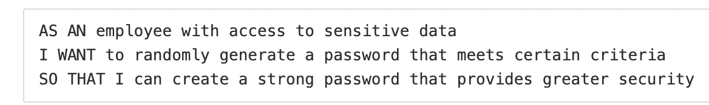
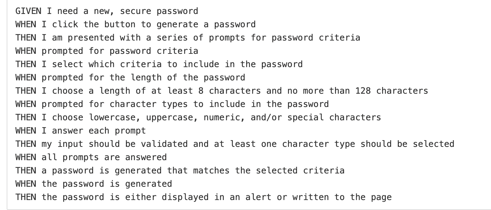
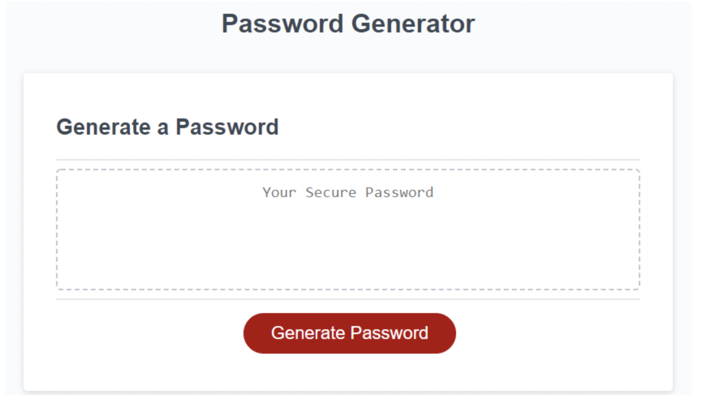

# Secure Password Generator
# Shane O'Connell
## 12-10-2020

### User Story

### Criteria

### Goal 

## Pseudocode Example

1. Use __prompts__ and __confirms__ to get user selections and save them as __variables__
2. Check if selected length meets the __8-128 range__
3. Check __IF__ the user wanted a certain character type, and __IF__ they do, __THEN__ add those characters to a list of possible characters
4. Once you have the array or string of possible characters made based on what the user selected, use a __FOR LOOP__ to loop through the list of possible characters and __randomly select__ a character from it each time, add that character to a new string, which will be the password.

## Description
 
This assignment was a slog.  I really struggled to get off the ground on this one. Even after speaking with BCS Learning Assistant and spending most of my time after class Wednesday Googling, sorting through Stack Overflow and W3 Schools threads, trying out Reddit and a free Javascript course on Scrimba, I was left scratching my head, confused.   
 
I'm okay with the results.  At the end of the day, I got something down, even if it's not a "functional generator." I was able to find some very helpful videos and believe that I learned a lot along the way during this assignment.   I definitely got close to pulling my hair out a few times and there may have been some angry "whisper shouting" but I'm putting this assignment behind me. 
